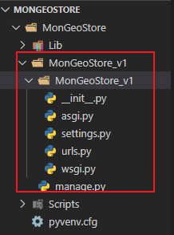
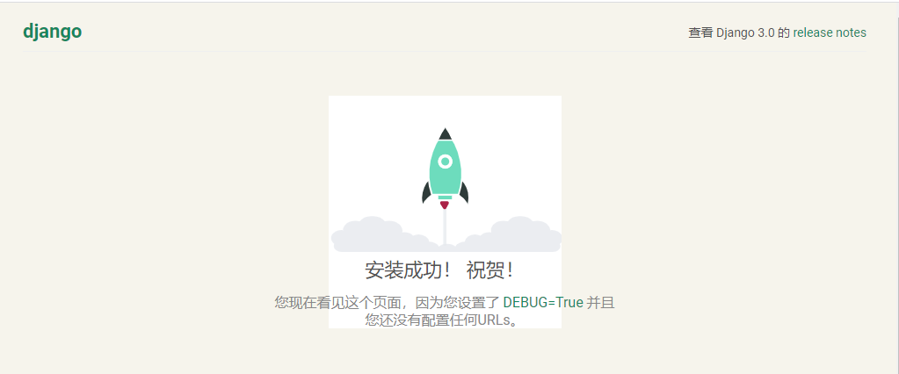
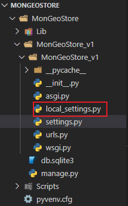
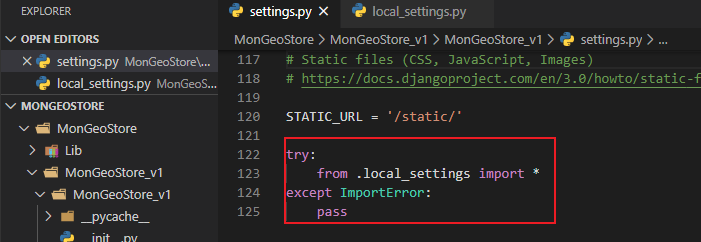

## Django

[TOC]

### 1.虚拟环境virtualenv

#### 1.1 安装

```
pip install virtualenv
```

#### 1.2 创建虚拟环境

```
1.打开终端
2.安装virtualenv
	pip install virtualenv
3.关闭终端
4.通过命令进入指定目录
	cd 目录
5.创建虚拟环境
	virtualenv 目录名
```

### 2.  安装Django

```shell
#创建虚拟环境
virtualenv MonGeoStore

#激活虚拟环境,先切换到目录
cd MonGeoStore

.\Scripts\activate

#安装Django
pip install django
```

#### 2.1 在Django中创建项目

- 注意：创建应用必须先进入虚拟环境

```shell
 django-admin startproject MonGeoStore_v1
```


生成如下图所示



```
项目目录说明：

__init__.py: 说明test1是一个python包。

settings.py: 项目的配置文件。

urls.py: 进行url路由的配置。

wsgi.py:  web服务器和Django交互的入口。

manage.py:  项目的管理文件。
```

#### 2.2 运行

```
cd .\MonGeoStore_v1\
python manage.py runserver
```


#### 2.3 浏览器访问

访问：http://127.0.0.1:8000/




### 3. 本地配置

新建local_settingspy，设置本地配置



#### 3.1 在setting中导入

```python
try:
    from .local_settings import *
except ImportError:
    pass
```



#### 3.2 创建自己的本地配置

```
LANGUAGE_CODE = 'zh-hans'

```

**切记：**给别人代码时，local_settings.py不要给local_settings.py


### 4. 创建应用

```
python manage.py startapp MonGeoStore_app
```

