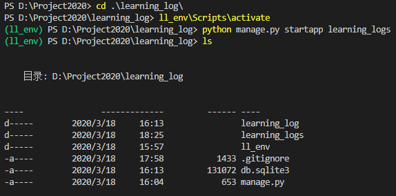
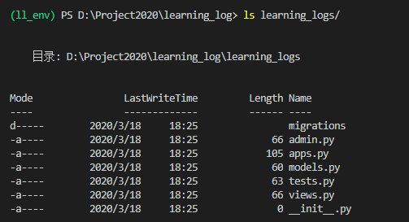
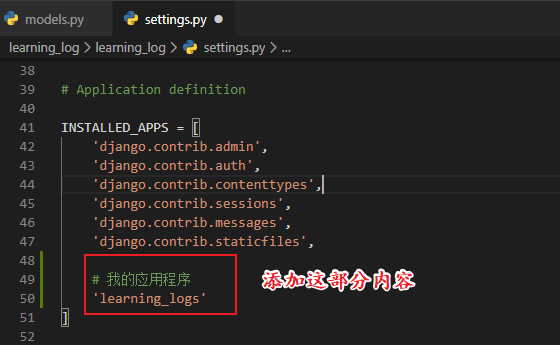
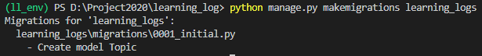
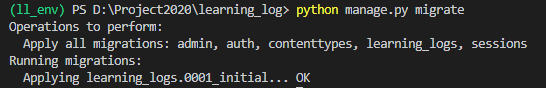
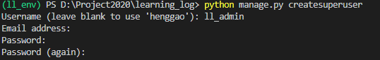
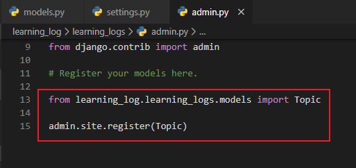
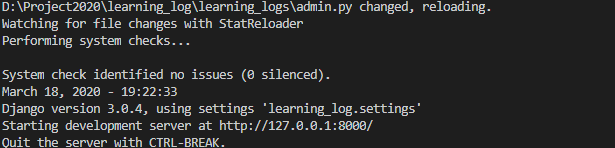
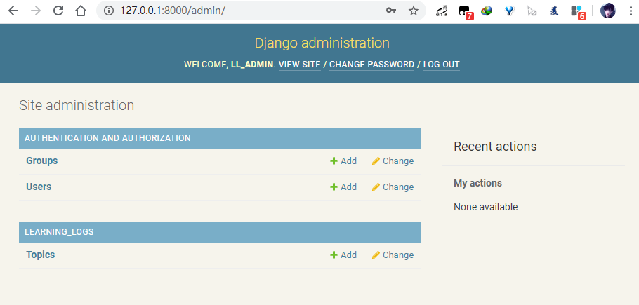

# 创建应用程序

[TOC]

## 一、启动

```
PS D:\Project2020> cd .\learning_log\
PS D:\Project2020\learning_log> ll_env\Scripts\activate
(ll_env) PS D:\Project2020\learning_log> python manage.py startapp learning_logs
(ll_env) PS D:\Project2020\learning_log> ls
```

- 命令startapp appname让Django建立创建应用程序所需的基础设施。如果现在查看项目目录，将看到其中新增了一个文件夹learning_logs



```
ls learning_logs/
```




## 二、定义模型

- models.py

  ```python
  from django.db import models
  
  # Create your models here.
  class Topic(models.Model):
      '''用户学习的主题'''
      text = models.CharField(max_length=200)
      date_added = models.DateTimeField(auto_now=True)
  
      def __str__(self):
          '''返回模型字符串表示'''
          return self.text
  ```

  

## 三、激活模型

要使用模型，必须让Django将应用程序包含到项目中。为此，打开settings.py（它位于目录learning_log/learning_log中），你将看到一个这样的片段，即告诉Django哪些应用程序安装在项目中：

- settings.py



接下来，需要让Django修改数据库，使其能够存储与模型Topic相关的信息。为此，在终端窗口中执行下面的命令：

```
python manage.py makemigrations learning_logs
```



命令makemigrations让Django确定该如何修改数据库，使其能够存储与我们定义的新模型相关联的数据。输出表明Django创建了一个名为0001_initial.py的迁移文件，这个文件将在数据库中为模型Topic创建一个表。

下面来应用这种迁移，让Django替我们修改数据库：

```
python manage.py migrate
```



每当需要修改“学习笔记”管理的数据时，都采取如下三个步骤：修改models.py；对
learning_logs调用makemigrations；让Django迁移项目。


## 四、Django 管理网站

### 4.1、创建超级用户

为在Django中创建超级用户，请执行下面的命令并按提示做：

```
python manage.py createsuperuser
```

- 用户名：ll_admin

- 密码：123456



### 4.2、向管理网站注册模型

我们创建应用程序learning_logs时，Django在models.py所在的目录中创建了一个名为
admin.py的文件。

为向管理网站注册Topic，请输入下面的代码：

- admin.py



运行

```
python manage.py runserver
```




浏览器访问http://localhost:8000/admin/，输入

- 用户名：ll_admin
- 密码：123456



