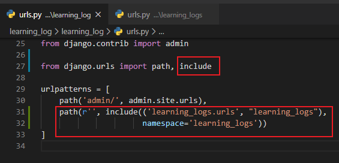

# 创建网页

[TOC]


## 一、映射URL

打开项目主文件夹learning_log中的文件urls.py

我们需要包含learning_logs的URL：

- urls.py

```python
from django.contrib import admin

from django.urls import path, include

urlpatterns = [
    path('admin/', admin.site.urls),
    path(r'', include(('learning_logs.urls', "learning_logs"),
                      namespace='learning_logs'))
]

```



默认的urls.py包含在文件夹learning_log中，现在我们需要在文件夹learning_logs中创建另一个urls.py文件

- urls.py

```python
"""定义learning_logs的URL模式"""

from django.conf.urls import url

from . import views

urlpatterns = [
    # 主页
    url(r"^$", views.index, name='index'),
]
```

## 二、编写视图

learning_logs中的文件views.py是你执行命令python manage.py startapp时自动生成的。

- views.py

```python
from django.shortcuts import render

# Create your views here.
def index(request):
    """学习笔记主页"""
    return render(request,"learning_logs/index.html")
```

## 三、编写模板

在文件夹learning_logs中新建一个文件夹，并将其命名为templates。在文件夹templates中，再新建一个文件夹，并将其命名为learning_logs。这好像有点多余（我们在文件夹learning_logs中创建了文件夹templates，又在这个文件夹中创建了文件夹learning_logs），但建立了Django能够明确解读的结构，即便项目很大，包含很多应用程序亦如此。在最里面的文件夹learning_logs中，新建一个文件，并将其命名为index.html。

- index.html

```html
<p>Learning Log</p>
<p>Learning Log helps you keep track of your learning, for any topic you're
 learning about.</p>
```

- 运行

```powershell
python manage.py runserver
```

- 浏览器查看：http://127.0.0.1:8000/

