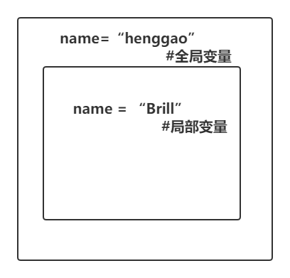
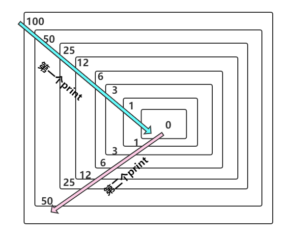

# 函数

[TOC]

## 一、形参与实参

- 函数

```python
def calculate(x,y): #形参
    c = x**y
    return c

s = calculate(2,3) #实参
print(s)
```

- 形参

- 实参


## 二、位置参数与关键参数

默认参数

位置参数、关键参数

- *args 

- **kwargs

```python
def register(name,*args,**kwargs):
    print(name,args,kwargs)
    
register("Alex",22,"Student",sex="M",address="Jiangsu")

#Alex (22, 'Student') {'sex': 'M', 'address': 'Jiangsu'}
```


## 三、全局变量与局部变量

1、定义一个函数

```python
name = "henggao" #全局变量
def change():
    name = "Brill" #局部参数
    print(name)
    
change() 

print(name)
```

- 输出如下

```
Brill
henggao
```



- 全局变量 global

- 局部变量 local


## 四、列表传递

```python
names = ["henggao","Brill"]
def change():
    names.append("James")
    return names

change()
print(names)
```

- 输出

```
['henggao', 'Brill', 'James']
```


## 五、嵌套函数

```python
name = " 全局name"
def change():
    name = " change name"

    def change2():
        name = "change2 name"
        print("第三层打印 " + name)
    change2()
    print("第二层打印 " + name)

change()
print("最外层打印 " + name)
```

- 输出

  ```
  第三层打印 change2 name
  第二层打印  change name
  最外层打印  全局name
  ```

  

## 六、匿名函数

```python
def calculate(x):
    return x**2

m = calculate(2)
print(m)

# 等价于匿名函数
n = lambda y:y**2

print(n(2))
```

- 输出

  ```
  4
  4
  ```

  

- 结合map函数使用

```python
def calc(x):
    return x**2

# res = map(calc,[1,2,3,4])
res = map(lambda x:x**2,[1,2,3,4])
for i in res:
    print(i)
```


## 七、高阶函数

变量可以指向函数，函数的参数能接受变量，那么一个函数就可以接受另一个函数作为参数，这种函数就称为高阶函数。

- 能接收一个或多个函数
- return 返回另一个函数

```python
def get_abs(n):
    return abs(n)

def add(x,y,f):
    return f(x) + f(y)

print(add(2,-10,get_abs))
```

- 输出

  ```
  12
  ```

  

## 八、递归函数

```python
# 循环
n = 100
 
while n > 0 :
    n = int(n / 2)
    print(n)

# 函数递归
def calc(n):
    print(n)
    n = int(n / 2)
    if n > 0:
        calc(n)

calc(100)
```

- 输出

  ```
  # 循环输出
  50
  25
  12
  6
  3
  1
  0
  
  # 递归函数输出
  100
  50
  25
  12
  6
  3
  1
  0
  1
  3
  6
  12
  25
  50
  ```

  - 解析图

  

- 类似于压栈，递归效率不高。

## 九、内置函数

