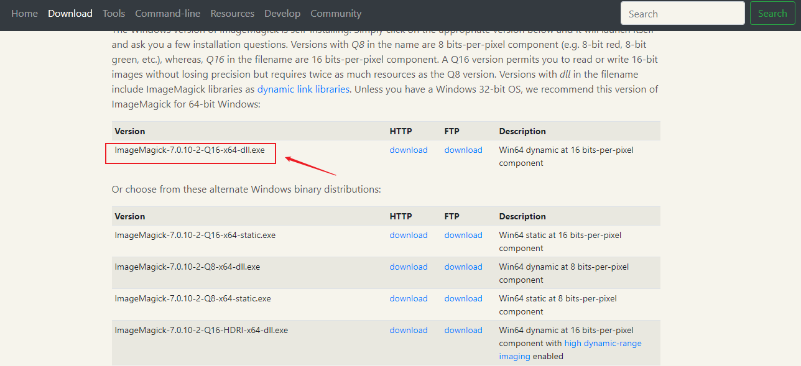

# 多个视频合并


## 一、安装Moviepy

```
pip install moviepy

#使用豆瓣源下载
pip install -i https://pypi.douban.com/simple moviepy
```


## 二、批量修改后缀名

```python
import os

# 列出vedio目录下所有的文件
# files = os.listdir('.')  # 如果path为None，则使用path = '.'
files = os.listdir('./video')  # 如果path为None，则使用path = '.'

for filename in files:
    portion = os.path.splitext(filename)  # 分离文件名与扩展名
    # 如果后缀是jpg
    if portion[1] == '.MP4':
        # 指定的路径
        os.chdir('./video')
        # 重新组合文件名和后缀名
        newname = portion[0] + '.mp4'
        os.rename(filename, newname)
```


## 三、视频拼接1

```python
from moviepy.editor import *
import os

# 定义一个数组
L = []

# 访问 video 文件夹 (假设视频都放在这里面)
for root, dirs, files in os.walk("./video"):
    # 按文件名排序
    files.sort()
    # 遍历所有文件
    for file in files:
        # 如果后缀名为 .mp4
        if os.path.splitext(file)[1] == '.mp4':
            # 拼接成完整路径
            filePath = os.path.join(root, file)
            # 载入视频
            video = VideoFileClip(filePath)
            # 添加到数组
            L.append(video)

# 拼接视频
final_clip = concatenate_videoclips(L)

# 生成目标视频文件
final_clip.to_videofile("./target.mp4", fps=24, remove_temp=False)

```


## 三、视频拼接（带面板）

```python
'''
@Description: 
@Version: 1.0
@Autor: Henggao
@Date: 2020-03-27 18:28:46
@LastEditors: Henggao
@LastEditTime: 2020-03-27 18:35:32
'''
import os
import sys
from PyQt5.QtWidgets import (QWidget, QPushButton, QLineEdit, QLabel,
                             QInputDialog, QApplication, QFileDialog)
from natsort import natsorted
from moviepy.video.compositing.concatenate import concatenate_videoclips
from moviepy.video.io.VideoFileClip import VideoFileClip
from PyQt5.QtCore import *
import imageio
# imageio.plugins.ffmpeg.download()


class Example(QWidget):
    def __init__(self):
        super().__init__()

        self.initUI()

    def initUI(self):
        # 源文件选择按钮和选择编辑框
        self.source_btn = QPushButton('source', self)
        self.source_btn.move(30, 30)
        self.source_btn.resize(60, 30)
        self.source_btn.clicked.connect(self.select_source)
        self.source_le = QLineEdit(self)
        self.source_le.move(120, 30)
        self.source_le.resize(250, 30)

        # 存储文件选择按钮和选择编辑框
        self.target_btn = QPushButton('target', self)
        self.target_btn.move(30, 90)
        self.target_btn.resize(60, 30)
        self.target_btn.clicked.connect(self.select_target)
        self.target_le = QLineEdit(self)
        self.target_le.move(120, 90)
        self.target_le.resize(250, 30)

        # 保存按钮，调取数据增加函数等
        self.save_btn = QPushButton('save', self)
        self.save_btn.move(30, 150)
        self.save_btn.resize(150, 30)
        self.save_btn.clicked.connect(self.addNum)

        # 退出按钮，点击按钮退出整个程序
        self.cancle_btn = QPushButton('cancle', self)
        self.cancle_btn.move(220, 150)
        self.cancle_btn.resize(150, 30)
        self.cancle_btn.clicked.connect(QCoreApplication.quit)

        # 执行成功返回值显示位置设置
        self.result_le = QLabel(self)
        self.result_le.move(30, 210)
        self.result_le.resize(340, 30)

        # 技术支持框
        self.sourceLabel = QLabel(self)
        self.sourceLabel.move(30, 360)
        self.sourceLabel.resize(340, 30)
        self.sourceLabel.setText("Technical support:Azrael ")
        self.sourceLabel.setStyleSheet("color:blue;font-size:18px")
        self.sourceLabel.setAlignment(Qt.AlignCenter)

        # 整体界面设置
        self.setGeometry(400, 400, 400, 400)
        self.setWindowTitle('video binding')
        self.show()

    # 打开的视频文件路径
    def select_source(self):
        source = QFileDialog.getExistingDirectory(
            self, "select the video directory", "C:/")
        self.source_le.setText(str(source))

    # 保存的视频文件名称，要写上后缀名
    def select_target(self):
        target, fileType = QFileDialog.getSaveFileName(
            self, "select the save directory", "C:/")
        self.target_le.setText(str(target))

    def addNum(self):
        source = self.source_le.text().strip()  # 获取源视频文件存储地址
        target = self.target_le.text().strip()  # 获取合成视频保存地址
        video_list = []  # 定义加载后的视频存储列表
        for root, dirs, files in os.walk(source):
            files = natsorted(files)  # 按1,2,10类似规则对视频文件进行排序
            for file in files:
                if os.path.splitext(file)[1] == ".mp4":  # 判断视频文件格式是否为.mp4
                    file_path = os.path.join(source, file)  # 粘合完整视频路径
                    video = VideoFileClip(file_path)  # 加载视频
                    video_list.append(video)  # 将加载完后的视频加入列表
        final_clip = concatenate_videoclips(video_list)  # 进行视频合并
        final_clip.to_videofile(target, fps=24, remove_temp=True)  # 将合并后的视频输出
        self.result_le.setText("ok!")  # 输出文件后界面返回OK
        self.result_le.setStyleSheet(
            "color:red;font-size:40px")  # 设置OK颜色为红色，大小为四十像素
        self.result_le.setAlignment(Qt.AlignCenter)  # OK在指定框内居中


if __name__ == '__main__':
    app = QApplication(sys.argv)
    ex = Example()
    sys.exit(app.exec_())

```

参考：https://www.jianshu.com/p/98a0c091c4bf

## 四、字母跳动

还需要安装

- scipy

  ```
  pip install -i https://pypi.douban.com/simple scipy   
  ```

- ImageMagick，这个到[官网](https://imagemagick.org/script/download.php)下载。找到windows64位




下载好点击安装，选择安装目录，其他默认即可。


