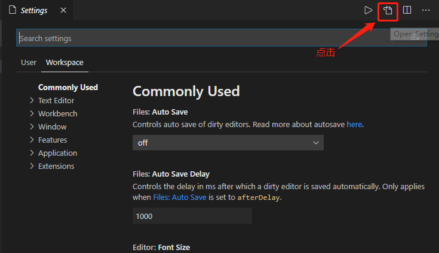
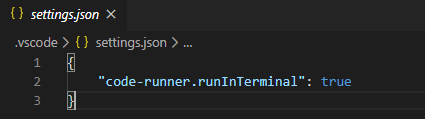

# 问题总结

[toc]

## Python

1、[VS Code 在执行Python代码时OUTPUT输出中文乱码最佳解决方案](https://blog.csdn.net/fucaijin/article/details/94301901)

2、终端无法输入,提示如图


- 解决

在settings.json中配置



添加如下信息

```json
{
    "code-runner.runInTerminal": true
}
```




## Java


## MongoDB