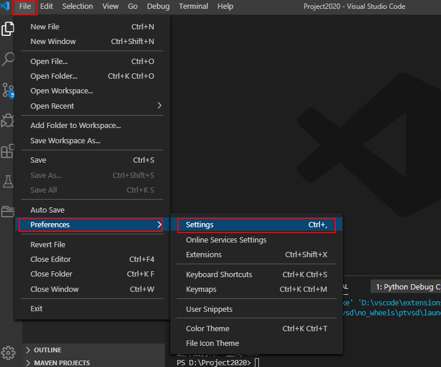
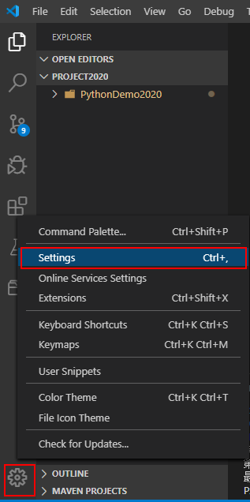
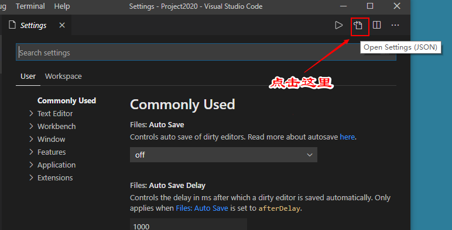
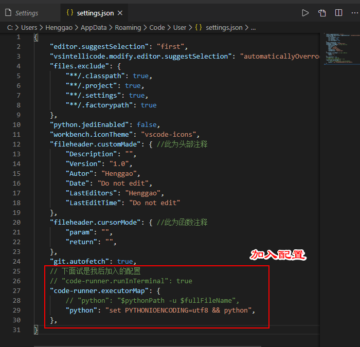
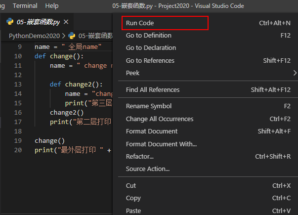
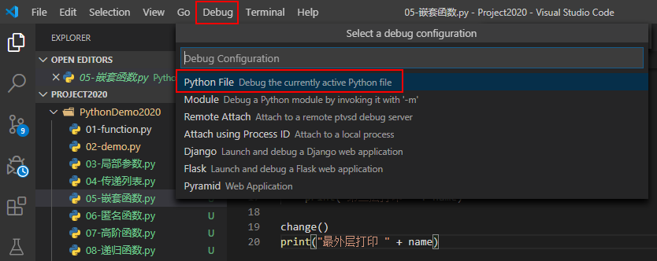
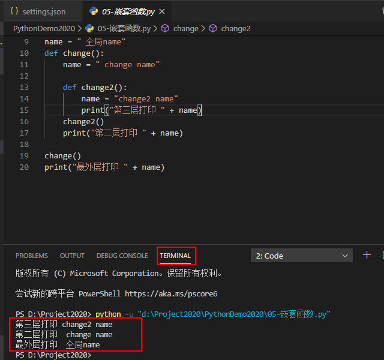
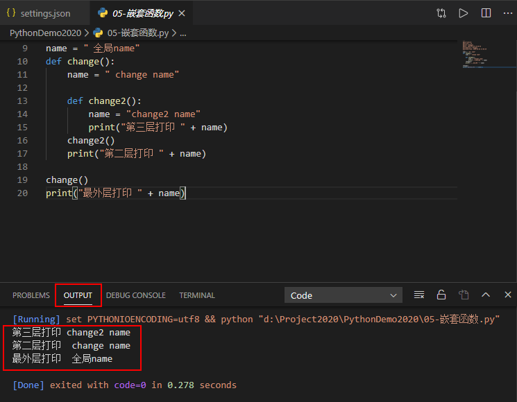

# 问题总结

[toc]

## Python

1、[VS Code 在执行Python代码时OUTPUT输出中文乱码最佳解决方案](https://blog.csdn.net/fucaijin/article/details/94301901)

### 1、装入`Code Runne`r插件，output中文乱码

这里设置系统编码问题。可以了解一下：ASCII、GB2312、GBK、UTF-8、Unicode等编码。Windows一般是GBK，Mac一般是UTF-8。

#### 方法一

在每个python文件前添加如下内容，即可在输出【output】正常显示。

```python
import io
import sys
#改变标准输出的默认编码
sys.stdout=io.TextIOWrapper(sys.stdout.buffer,encoding='utf8')
```


#### 方法二

1.1、打开【文件】-【首选项】-【设置】



我喜欢这样打开，当然可以是`ctrl+,`快捷键打开。



1.2、点击【打开设置】



1.3、加入如下配置

```json
    // 下面试是我后加入的配置
    // "code-runner.runInTerminal": true
    "code-runner.executorMap": {
        // "python": "$pythonPath -u $fullFileName",
        "python": "set PYTHONIOENCODING=utf8 && python",
    },
```



1.4、运行，右击文件，点击【Run Code】即可。



当然我们仍然可以使用调式的方式【Debug】，或者按【F5】，这样就不适用Run Code的插件方式了。



1.5、补充解释一下这段配置

- 第一段配置

- ```
  "code-runner.runInTerminal": true 
  ```

  程序在终端【Terminal】运行，例子如下

  

- 第二段配置

- ```json
      "code-runner.executorMap": {
          // "python": "$pythonPath -u $fullFileName",
          "python": "set PYTHONIOENCODING=utf8 && python",
      },
  ```

  这设置在输出【output】显示，比终端出要美观。我比较喜欢这个。如下面这个例子

  


### 2、Output无法输入,提示如图

提示只读，不能编辑，这里只能使用终端调式的方式运行。


## Java


## MongoDB